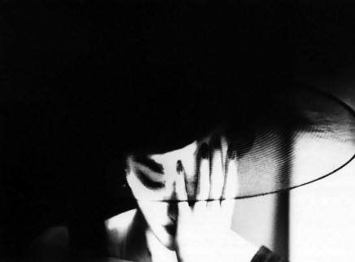
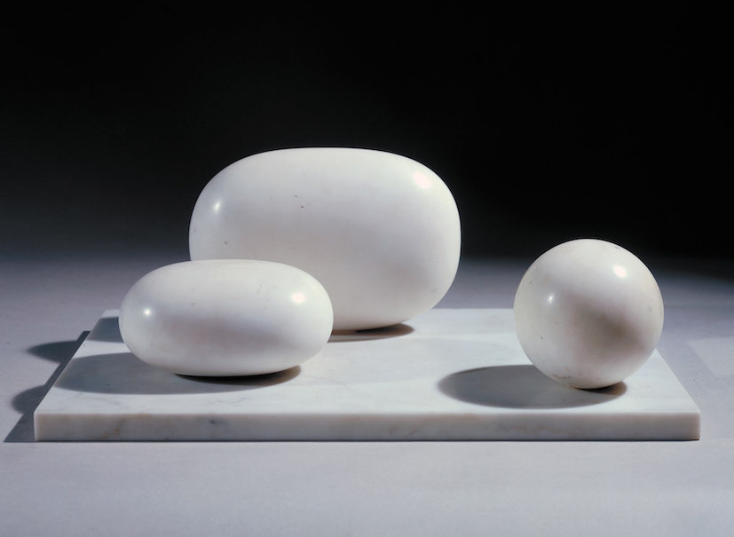
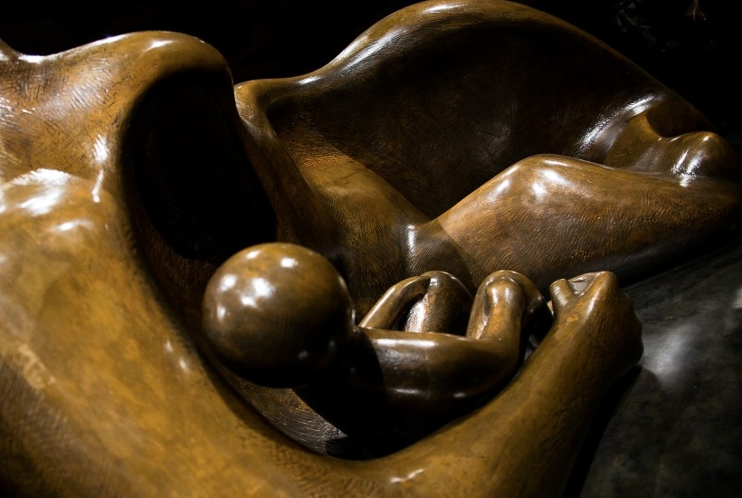
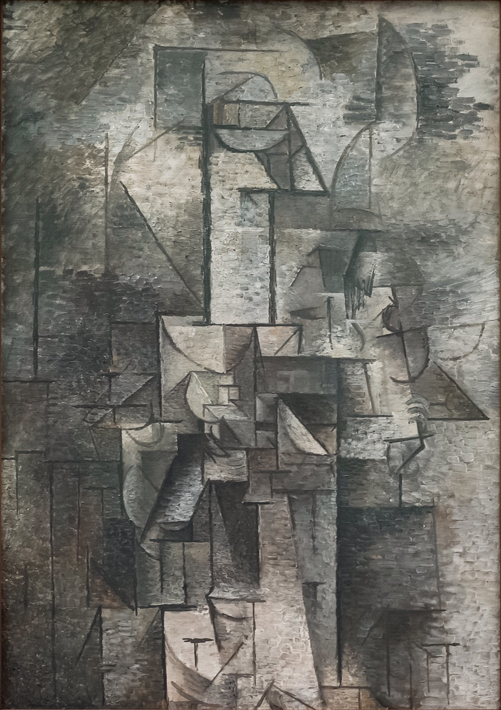
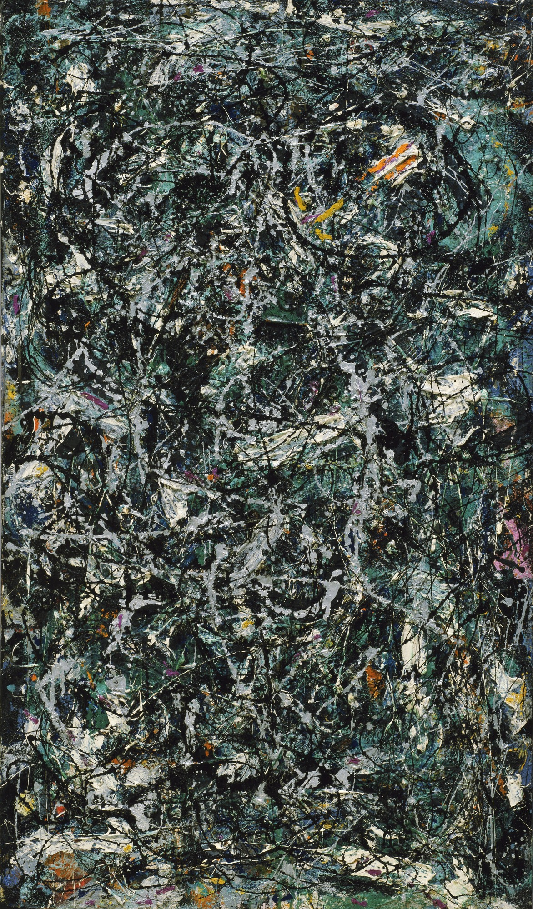
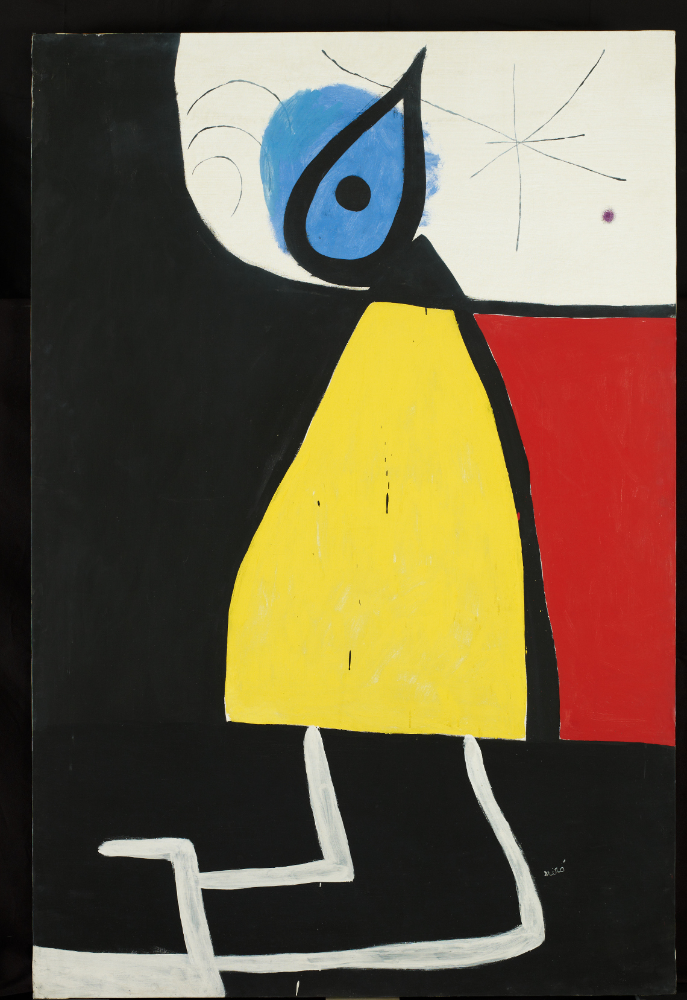
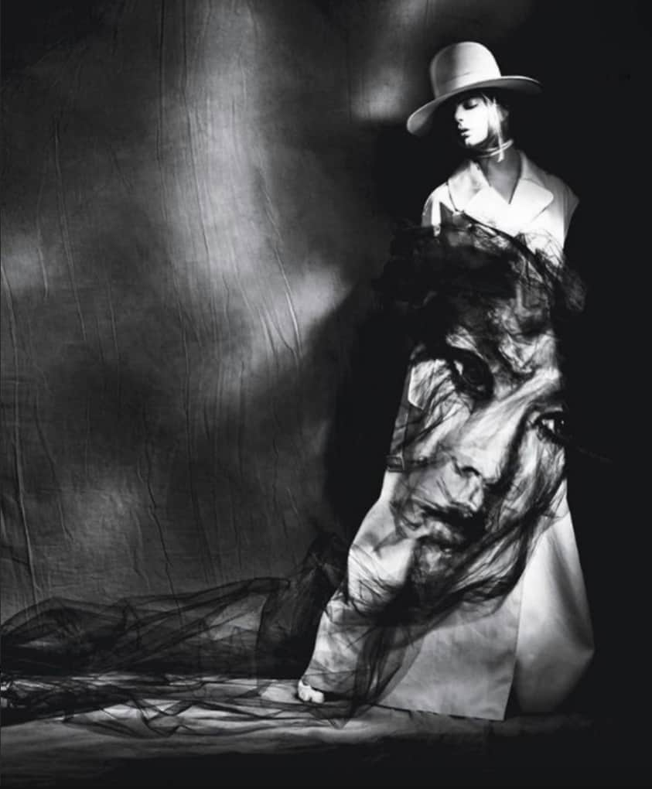
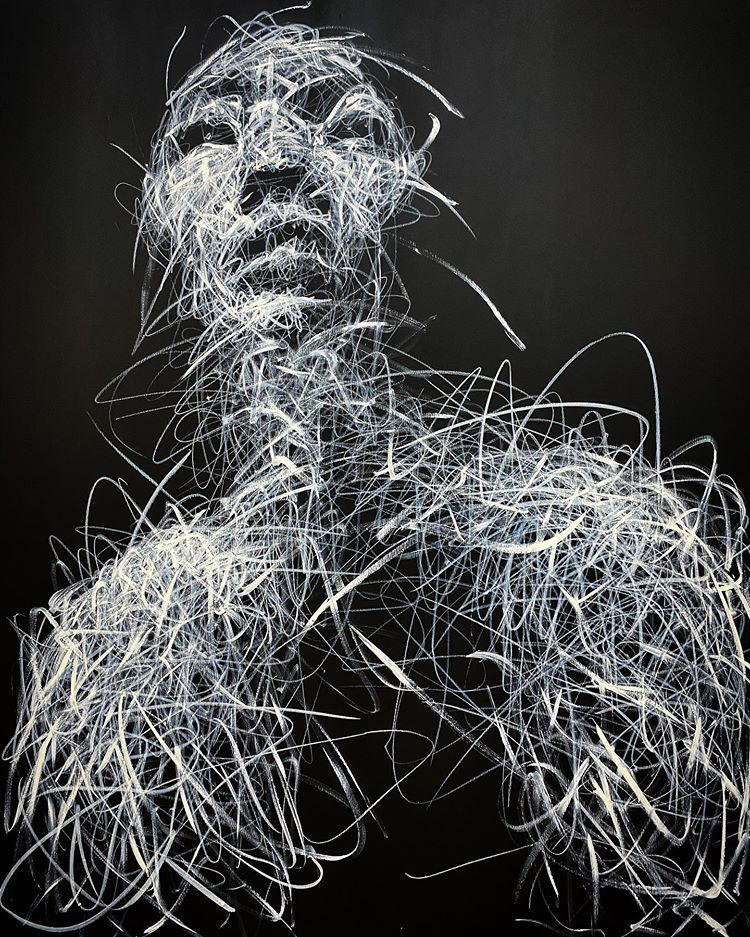
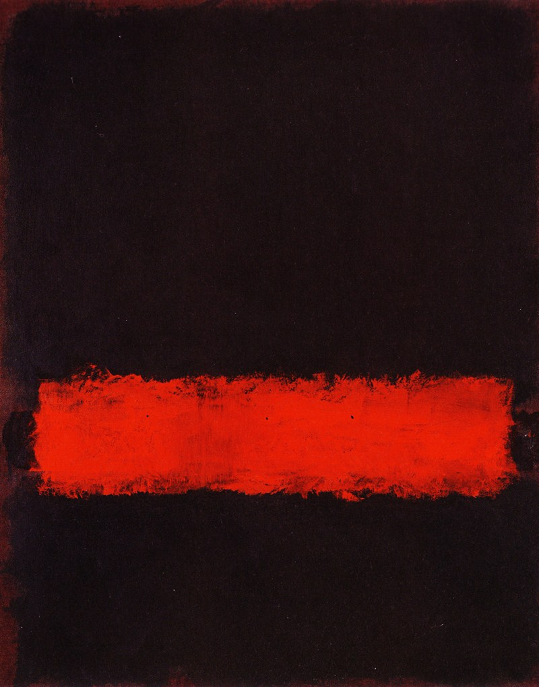

# Title


# Introduction

Prepare a list of 10 work of art (could be video games, movies, TV series, books, music, painting)
For each of them you need to display:
- Titre
- Une image d'illustration
- Un lien (bande annonce)
- Catégorie
- L'auteur
- Description

Then create cards and make a collection website that should look like this:


# Content
Here are my 10 choices : 

<br>

## Number One


| Title       |   |
|-------------|---|
| Link        | [Info on Lillian Bassans](artnet.com/artists/lillian-bassman)  |
| Category    | Photography |
| Artist      | Lillian Bassans |
| Description | Lillian Bassman was a famed American fashion photographer renowned for her work at Harper’s Bazaar magazine. Bassman’s hallmark images are high-contrast black-and-white images of society women, actresses, and models from the 1950s and 1960s—especially of contemporary top model Barbara Mullen, who was her muse.|

<br>

## Number Two



| Title      | Three forms, 1935  |
|-------------|---|
| Link        | [Website](http://barbarahepworth.org.uk/)  |
| Category    | Sculpture, marble |
| Artist      | Barbara Hepworth |
| Description | "Carving is interrelated masses conveying an emotion; a perfect relationship between the mind and the colour, light and weight which is the stone, made by the hand which feels. It must be so essentially sculpture that it can exist in no other way, something completely the right size but which has growth, something still and yet having movement, so very quiet and yet with a real vitality."_(B.Hepworth)_  |


<br>

## Number Three


| Title      | Sleeping Muse, 1910 |
|-------------|---|
| Link        | [Brancusi exposition in Bruxelles](bozar.be/fr/activities/150143-brancusi)  |
| Category    | Sculpture marble |
| Artist      | Constantin Brancusi |
| Description |What is real is not the external form, but the essence of things... it is impossible for anyone to express anything essentially real by imitating its exterior surface._(C.Brancusi)_  |


<br>

## Number Four


| Title      | Draped reclining Mother and Baby 1983   |
|-------------|---|
| Link        | [Henry Moore Fondation](https://www.henry-moore.org/#), [Burberry Makers House](https://uk.burberry.com/london-fashion-week/september-show-2017/)  |
| Category    | Sculpture, bronze |
| Artist      | Henry Moore |
| Description | Moore wrote: ‘There are three fundamental poses of the human figure. One is standing, the other is seated, and the third is lying down… But of all the three poses, the reclining figure gives me the most freedom compositionally and spatially.’_(H. Moore)_ This sculpture was part of a collaboration with the fashion Burberry House   |

<br>

## Number Five



| Title      | La femme au violon, 1911 |
|-------------|---|
| Link        | [Picasso museum in Paris](https://www.museepicassoparis.fr/fr)   |
| Category    | Painting |
| Artist      | Pablo Picasso |
| Description | Painting is a blind man's profession. He paints not what he sees, but what he feels, what he tells himself about what he has seen. _(P.Picasso)_

<br>

## Number Six



| Title      | Fall Fathom Five, 1947 |
|-------------|---|
| Link        | [Jackson Pollock](http://jacksonpollock.org/)  |
| Category    | Painting |
| Artist      | Jackson Pollock |
| Description | Something in me knows where I’m going, and - well, painting is a state of being. ... Painting is self-discovery. Every good artist paints what he is. _(J.Pollock)_|

<br>

## Number Seven


| Title      | Femme dans la nuit, 1973  |
|-------------|---|
| Link        | [Foundation Miro](https://www.fmirobcn.org/en/)  |
| Category    | Painting |
| Artist      | Joan Miro |
| Description | You can look at a picture for a week and never think of it again. You can also look at the picture for a second and think of it all your life. _(J.Miro)_|

<br>

## Number Eight


| Title      | Margiela Coat  |
|-------------|---|
| Link        | [Benjamin Shine website](https://www.benjaminshine.com/)  |
| Category    | Canvas with tulle, 2017 |
| Artist      | Benjamin Shine |
| Description | Created in collaboration with John Galliano for Maison Margiela, black tulle lining from inside the white trench coat escapes from the back seam, flowing around the body to reveal an intricately formed face. Constructed via the process of hand-sewing, the piece floats over the trench coat so as to move independently. The piece took over 300 hours to make over the course of several months before being shown at Paris Couture Fashion Week. The piece has been purchased by the Metropolitan Museum of Art, New York.|

<br>

## Number Nine


| Title      | Unknown  |
|-------------|---|
| Link        | [Website](http://www.hom-nguyen.com/)  |
| Category    | Painting - Acrylic on canvas |
| Artist      | Hom Nguyen  |
| Description | His subtle representations deal with the duality of the visible and the invisible, the material and the immaterial. Thus, Hom Nguyen pushes each of us to a reflection, an introspection, on what we show of ourselves, what we are trying to hide and what we really are.|


<br>

## Number Ten


| Title      | Untitled  |
|-------------|---|
| Link        | [Mark Rothko info](http://www.markrothko.org/)
| Category    | Painting |
| Artist      | Mark Rothko|
| Description | The most interesting painting is one that expresses more of what one thinks than of what one sees. _(M.Rothko)_|


# Technologies


# Setup
```git
git init
git clone (url)
```


# Sources

# Contributing
Pull requests are welcome. For major changes, please open an issue first to discuss what you would like to change.

Please make sure to update tests as appropriate.

## License
[MIT](https://choosealicense.com/licenses/mit/)
